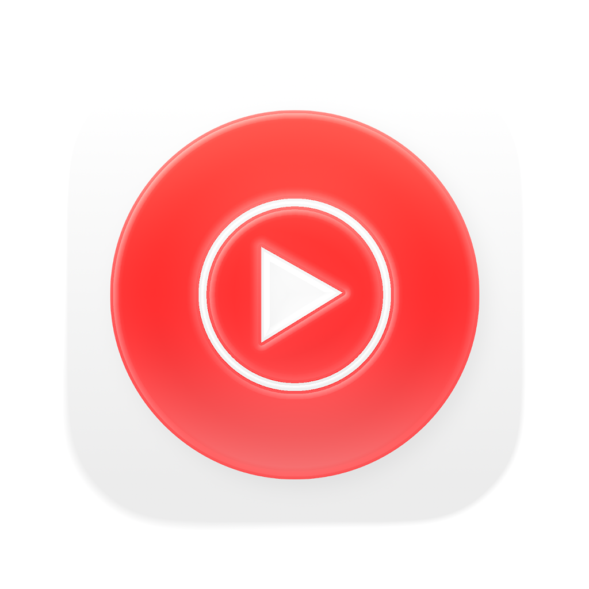

  

# Music — Open Source Web Wrapper for YouTube Music

Music is an open-source macOS web wrapper for YouTube Music built with Swift and WebKit for Apple Silicon and Intel Macs. Enjoy your favorite tracks while you work or browse, without worrying about accidentally closing a browser tab. Your music keeps playing in the background, even when you close the app window.

Designed with privacy and security in mind, Music has no developer-operated backend and sends no personal data, analytics, or listening history to the developer. Official installers are signed with an Apple Developer ID and notarized by Apple. See [Privacy](#privacy) for details.

  

## Download

 
For Macs with Apple Silicon chips: M1, M2, M3, and later.

 
For Macs with an Intel processor.

[See GitHub Releases](https://github.com/indradprasetya/yt-music-webkit/releases)

## Features

- **Native Controls menu:** Control playback, volume, and mute, or choose Shuffle and Repeat Off, All, or One. Shuffle and Repeat stay in sync with YouTube Music.
- **Background playback:** Music keeps playing when you close the window. Click the Dock icon to reopen it, or press Command-Q to quit.
- **macOS Now Playing:** Play, pause, and change tracks from the system's playback controls.

  

## Privacy

Music does not collect personal data or send analytics, telemetry, or listening history to the developer. The app has no developer-operated backend.

Music displays the YouTube Music website using WebKit. Google/YouTube may collect and process data when you sign in, listen, or interact with the service, as described in [Google's Privacy Policy](https://policies.google.com/privacy). WebKit stores cookies and website data locally on your Mac to maintain your session.

Update checks, installer downloads, What's New, and startup message checks contact GitHub or GitHub Pages. These requests share standard connection information, such as your IP address, with GitHub under its [Privacy Statement](https://docs.github.com/en/site-policy/privacy-policies/github-general-privacy-statement). Startup messages use a separate, temporary web session without your YouTube cookies. The last successfully checked app version and IDs of one-time messages already shown stay on your Mac; neither is sent with message checks.

Official release installers are signed with an Apple Developer ID and notarized by Apple. Sparkle verifies update signatures before installation.

## Show your support

Thank you so much for the boba tea! 🧋 Your support means a lot to me and helps me keep improving Music. I hope this little app makes your everyday listening a little better. Happy listening, and thanks for being part of the journey! 🎶

[🧋 Buy me a boba tea on Ko-fi](https://ko-fi.com/indradprasetya)

## License

Copyright © 2026 indradprasetya.

Music's source code is licensed under the **GNU General Public License version 3 only** (`GPL-3.0-only`). You may use, modify, and redistribute it under the terms of [LICENSE](LICENSE). It is provided without warranty.

When distributing Music or a modified version, provide the corresponding source code under GPLv3. See [Build and release](#build-and-release) for instructions.

Third-party components retain their own licenses. [THIRD_PARTY_NOTICES.txt](THIRD_PARTY_NOTICES.txt) contains the notices for Sparkle and its bundled components. Both license files are included in the app's `Contents/Resources` directory.

Music is a third-party app and is not affiliated with, endorsed by, or sponsored by Google LLC or YouTube. YouTube Music, its branding, and the content accessed through the service are not covered by this project's license and remain subject to their respective owners' rights and the [YouTube Terms of Service](https://www.youtube.com/static?template=terms).
